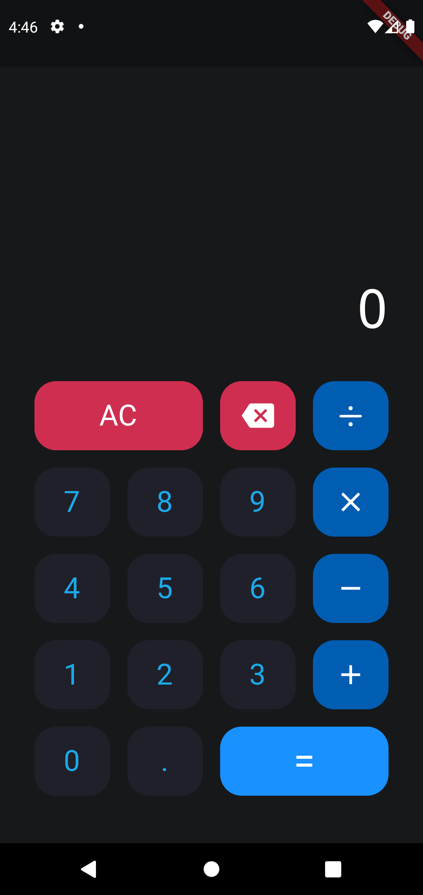

# Calculadora

Aplicativo de calculadora desenvolvido em Flutter para primeira avaliação da disciplina de Programação para Dispositivos Móveis.

## Funcionalidades

- Operações básicas
- All clear
- Backspace

## Interface

A interface foi baseada no design freebie <a target="_blank" href="https://www.figma.com/community/file/984658356416751911">Calculator App Ui Design</a> de Sadek Hossen Rony.

